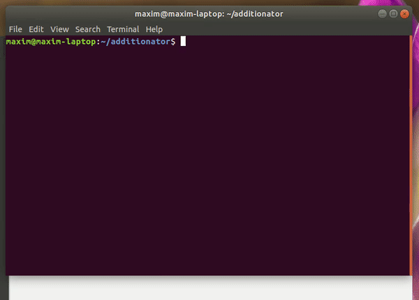

# Please Readme


We love programming, but one thing we have to do is write readmes. Wouldn't it be easier if we could just have a general structure we can use every time to minimize energy and maximize the output? please-readme does just that.

We love your contributions, so go ahead, look below and see how to contribute. P.S: for those asking, yes this readme was made by please-readme.

See the documentation at https://github.com/mrmaxguns/please-readme/wiki

## Getting Started
Here we will go through how to set up a copy of please-readme on your local machine for development purposes. See the "wiki" tab for the actual documentation.

## Prerequisites
* [Python 3.6 or greater](https://www.python.org/downloads/)

## Installing
1. Fork this repository by clicking the "fork" button on the top right of the homepage of this repo.
2. Now, go to the forked repository and click on the green `clone or download` button. Copy the url.
3. Go to your command line and go to the directory where you want to clopository. Then type `git clone` followed by the url you copied:
```
git clone https://github.com/YOUR_USERNAME/please-readme.git
```
4. Now enter the cloned directory.
5. Finally, set up the upstream by typing the following:
```
git remote add upstream https://github.com/mrmaxguns/please-readme.git
```
6. install all requirements by typing:
```
pip3 install -r requirements.txt
```

## Built With
* [Python 3](https://www.python.org/) - the programming language

## Contributing
We love contributions, Please read [CONTRIBUTING.md](CONTRIBUTING.md) for information

## Versioning
We use [SemVer](semver.org) for versioning. For the versions available, see the tags on this repository.

## Authors
* **Maxim R.** - *initial work* - [mrmaxguns](https://github.com/mrmaxguns/)

## License
We use the MIT license, see [LICENSE.md](LICENSE.md) for details

## Acknowledgements
* Thanks so much to [PurpleBooth's README template](https://gist.github.com/PurpleBooth/109311bb0361f32d87a2)
